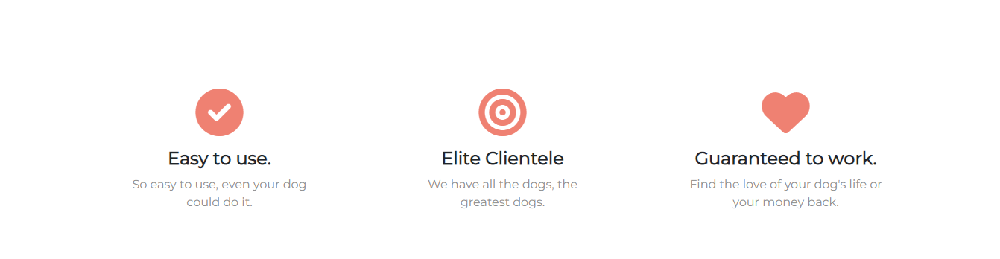
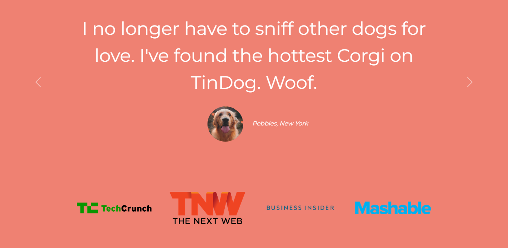
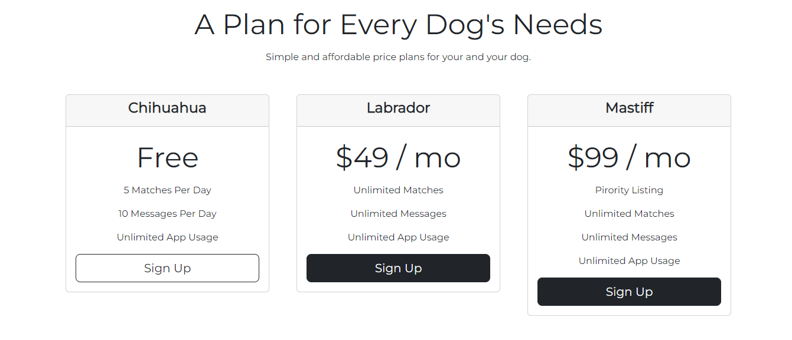
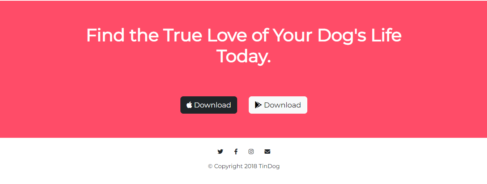

# tindog

<h3 align="left">Languages and Tools:</h3>

     

This is a simple frontend project which is built while learning full-stack web development by Dr.Angela yu the course is called  [The Complete 2022 Web Development Bootcamp](https://www.udemy.com/course/the-complete-web-development-bootcamp/) this is the best-seller course in web development on Udemy

## In this project, I learn
1. basic HTML
2. basic CSS
    - z-index
    - combined selector
3. bootstrap
    - carousel
    - card
4. Media Query Breakpoints

## A live link
[click here to see the live web](https://melakudemeke.github.io/tindog/)

## Result of the code

